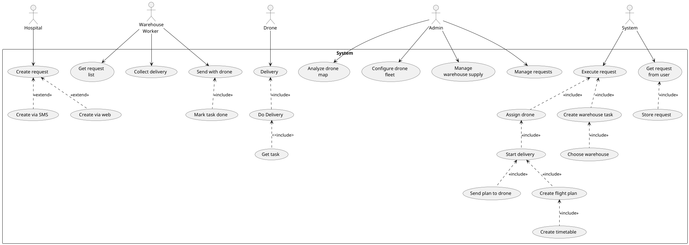
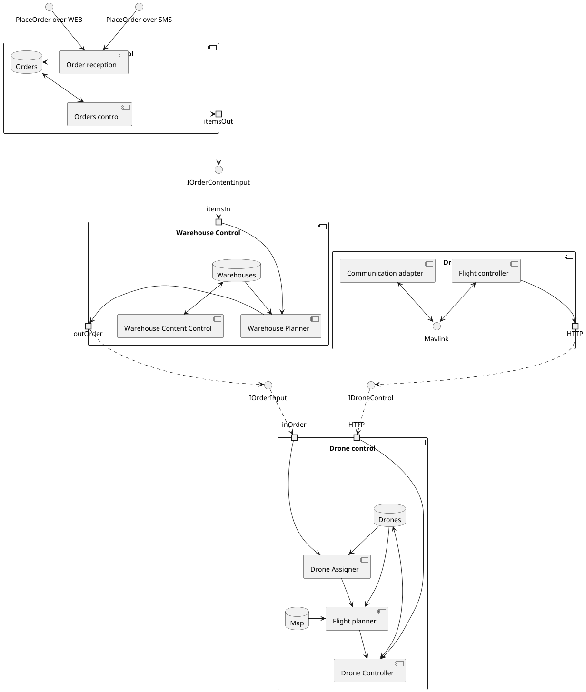

# SRS по системе "Доставка медикаментов дронами"
<!-- TOC -->
* [SRS по системе "Доставка медикаментов дронами"](#srs-по-системе-доставка-медикаментов-дронами)
  * [Назначение системы](#назначение-системы)
  * [Функционал системы](#функционал-системы)
  * [Характеристика пользователей](#характеристика-пользователей)
  * [Предположения и ограничения](#предположения-и-ограничения)
  * [Интерфейсы системы](#интерфейсы-системы)
    * [Пользовательские интерфейсы](#пользовательские-интерфейсы)
    * [Аппаратные интерфейсы](#аппаратные-интерфейсы)
    * [Программные и коммуникационные интерфейсы](#программные-и-коммуникационные-интерфейсы)
  * [Функциональные требования](#функциональные-требования)
      * [ID: FR1 - Дроны: отображение состояния дронов](#id-fr1---дроны-отображение-состояния-дронов)
      * [ID: FR2 - Дроны: изменение состава роя дронов](#id-fr2---дроны-изменение-состава-роя-дронов)
      * [ID: FR3 - Дроны: настройка параметров дрона](#id-fr3---дроны-настройка-параметров-дрона)
      * [ID: FR4 - Дроны: опрос позиции дронов](#id-fr4---дроны-опрос-позиции-дронов)
      * [ID: FR5 - Дроны: загрузка полетного задания на дрон](#id-fr5---дроны-загрузка-полетного-задания-на-дрон)
      * [ID: FR6 - Дроны: контроль выполнения](#id-fr6---дроны-контроль-выполнения)
      * [ID: FR7 - Заявки: подача заявки по SMS](#id-fr7---заявки-подача-заявки-по-sms)
      * [ID: FR8 - Заявки: подача заявки через портал](#id-fr8---заявки-подача-заявки-через-портал)
      * [ID: FR9 - Заявки: просмотр списка заявок](#id-fr9---заявки-просмотр-списка-заявок)
      * [ID: FR10 - Заявки: планирование доставки для заявки](#id-fr10---заявки-планирование-доставки-для-заявки)
      * [ID: FR11 - Заявки: отмена заявки, по которой ещё не началась доставка](#id-fr11---заявки-отмена-заявки-по-которой-ещё-не-началась-доставка)
      * [ID: FR12 - Заявки: оповещение о выполнении заявки](#id-fr12---заявки-оповещение-о-выполнении-заявки)
      * [ID: FR13 - Склады: внесение данных о поставках](#id-fr13---склады-внесение-данных-о-поставках)
      * [ID: FR14 - Склады: получение остатков товаров](#id-fr14---склады-получение-остатков-товаров)
      * [ID: FR15 - Склады: составление задания для сборщика на складе](#id-fr15---склады-составление-задания-для-сборщика-на-складе)
      * [ID: FR16 - Склады: просмотр заявок на сборку заказа](#id-fr16---склады-просмотр-заявок-на-сборку-заказа)
      * [ID: FR17 - Склады: получение списка дронов без задания на текущем складе](#id-fr17---склады-получение-списка-дронов-без-задания-на-текущем-складе)
      * [ID: FR18 - Планирование: определение маршрута для заявки учитывая рельеф местности](#id-fr18---планирование-определение-маршрута-для-заявки-учитывая-рельеф-местности)
      * [ID: FR19 - Планирование: определение маршрута для заявки учитывая маршруты других дронов](#id-fr19---планирование-определение-маршрута-для-заявки-учитывая-маршруты-других-дронов)
      * [ID: FR20 - Планирование: назначение дронов для выполнения заявки](#id-fr20---планирование-назначение-дронов-для-выполнения-заявки)
      * [ID: FR21 - Планирование: планирование расписания вылетов](#id-fr21---планирование-планирование-расписания-вылетов)
      * [ID: FR22 - Планирование: определение ближайших складов](#id-fr22---планирование-определение-ближайших-складов)
      * [ID: FR23 - Система: регистрация/авторизация операторов складов](#id-fr23---система-регистрацияавторизация-операторов-складов)
      * [ID: FR24 - Система: регистрация/авторизация складов](#id-fr24---система-регистрацияавторизация-складов)
      * [ID: FR25 - Система: регистрация/авторизация медучреждений и личный кабинет](#id-fr25---система-регистрацияавторизация-медучреждений-и-личный-кабинет)
  * [Нефункциональные требования](#нефункциональные-требования)
    * [Security](#security)
      * [ID: SEC1 - безопасность передачи данных](#id-sec1---безопасность-передачи-данных)
      * [ID: SEC2 - безопасное хранение ПД пользователей](#id-sec2---безопасное-хранение-пд-пользователей)
      * [ID: SEC3 - безопасность аккаунтов пользователей](#id-sec3---безопасность-аккаунтов-пользователей)
      * [ID: SEC4 - разграничение прав пользователей](#id-sec4---разграничение-прав-пользователей)
    * [Usability](#usability)
      * [ID: UR1 - удобство создания заявки через сайт](#id-ur1---удобство-создания-заявки-через-сайт)
      * [ID: UR2 - удобство формата для отправки заявки через СМС](#id-ur2---удобство-формата-для-отправки-заявки-через-смс)
      * [ID: UR3 - удобство отслеживания дронов](#id-ur3---удобство-отслеживания-дронов)
      * [ID: UR4 - удобство просмотра списка всех заявок](#id-ur4---удобство-просмотра-списка-всех-заявок)
      * [ID: UR5 - удобство просмотра статуса заявки](#id-ur5---удобство-просмотра-статуса-заявки)
    * [Reliability](#reliability)
      * [ID: REL1 - доступность системы](#id-rel1---доступность-системы)
      * [ID: REL2 - среднее время разрешения сбоя](#id-rel2---среднее-время-разрешения-сбоя)
      * [ID: REL3 - дублирование каналов](#id-rel3---дублирование-каналов)
    * [Performance](#performance)
      * [ID: PERF1 - количество одновременно обслуживаемых заявок за период времени без учета полета дрона](#id-perf1---количество-одновременно-обслуживаемых-заявок-за-период-времени-без-учета-полета-дрона)
      * [ID: PERF2 - количество одновременно обслуживаемых дронов](#id-perf2---количество-одновременно-обслуживаемых-дронов)
      * [ID: PERF3 - время доступа - загрузка страницы в среднем](#id-perf3---время-доступа---загрузка-страницы-в-среднем)
      * [ID: PERF4 - дисковое пространство системы хранения](#id-perf4---дисковое-пространство-системы-хранения)
    * [Design Constraints](#design-constraints)
      * [ID: DC1 - технологический стек бэкенда](#id-dc1---технологический-стек-бэкенда)
      * [ID: DC2 - технологический стек фронтенда](#id-dc2---технологический-стек-фронтенда)
      * [ID: DC3 - системы хранения данных](#id-dc3---системы-хранения-данных)
      * [ID: DC4 - средства безопасности](#id-dc4---средства-безопасности)
      * [ID: DC5 - техническое окружение сервера](#id-dc5---техническое-окружение-сервера)
      * [ID: DC6 - имплементация полетного контроллера](#id-dc6---имплементация-полетного-контроллера)
    * [Supportability constraints](#supportability-constraints)
      * [ID: SUPP1 - документирование API](#id-supp1---документирование-api)
      * [ID: SUPP2 - использование общепринятых шаблонов проектирования](#id-supp2---использование-общепринятых-шаблонов-проектирования)
      * [ID: SUPP3 - общепринятых стилей программирования, включая использование понятных именований переменных, классов, полей, методов, интерфейсов и тд](#id-supp3---общепринятых-стилей-программирования-включая-использование-понятных-именований-переменных-классов-полей-методов-интерфейсов-и-тд)
<!-- TOC -->

## Назначение системы

Система позволит контролировать доставку медикаментов дронами: создавать заявки на доставку, поиск нужного медикамента, подбор доступного дрона, контроль полёта дрона

## Функционал системы

- создание заявки на запрос на доставку по координатам времени и требуемому списку продуктов
- контроль за положением дронов
- выбор и назначение дронов для заказов в соответствии с их т.х.
- формирование полетных заданий
- учет наличия продуктов на складах

## Характеристика пользователей

- администратор
  - управляет роем дронов
  - контролирует процесс исполнения заявок
- ответственный за поставки от медучреждения
  - создает заявки на доставку крови и медикаменты через портал
  - получает доставку дроном
- оператор склада
  - собирает заказ

<!--
пострадавший ХУЙ ЗНАЕТ ОТ ЧЕГО (Ногу тигр откусил, это же африка)
отправляет заявку на медикаменты для оказания срочной медпомощи через SMS с указанием местоположения 
получает медикаменты дроном
-->

## Предположения и ограничения

- аппаратное и программное обеспечение дронов не входит в рассмотрение данной системы за исключением подсистемы программного адаптера полетного контроллера для подключения к системе.
- система не имеет своими целями предотвращение инцидентов связанных с утратой дронов и грузов при совершенных атаках с использованием физического доступа и средстве РЭБ.
- в систему не входит прогнозирование погодных условий на маршрутах полетов дронов

## Интерфейсы системы

### Пользовательские интерфейсы

В качестве основного пользовательского интерфейса выступает веб-приложение, которое предоставляет доступ к состоянию складов, заявкам и так далее в табличных формах с возможностью редактирования. Присутствует раздел визуализации полетных заданий с демонстрацией перемещения дронов по траекториям в реальном времени.

### Аппаратные интерфейсы

- Серверная часть системы не зависит от конкретного аппаратного обеспечения, то у нас в ней не будет аппаратных интерфейсов (Hardware Interfaces).
- Отсутствие зависимости от конкретного оборудования обозначает возможность использования любого аппаратного обеспечения, удовлетворяющее требованиям. В том числе и виртуальных. Например, при использовании Docker.

<!--Для взаимодействия с полетным контроллером модуль использует последовательный порт с протоколом MavLink при трансляции запросов сервера в запросы полетного контроллера. -->

### Программные и коммуникационные интерфейсы

- Веб приложение предоставляется по HTTPS протоколу, дополнительно предоставляются 2 REST API интерфейса: для взаимодействия с пользовательским интерфейсом и для приема данных с дронов.
- Интерфейсы баз данных и иных компонентов решения недоступны с внешней стороны системы.
- Процесс обработки запросов на транспортном уровне и ниже регламентируется операционной системой и системой контейнеризации, и не является частью решения.

## Функциональные требования

#### ID: FR1 - Дроны: отображение состояния дронов

**DESC:**
Система должна показывать операторам телеметрию с каждого дрона в режиме реального времени.

**RAT:**
Для предотвращения и своевременного реагирования на технические сбои, а также для оптимизации работы и поддержания высокого уровня безопасности при эксплуатации дронов.

#### ID: FR2 - Дроны: изменение состава роя дронов

**DESC:**
Система должна позволять операторам добавлять и удалять дронов из роя.

**RAT:**
Гибкость управления ресурсами, позволяя эффективно реагировать на изменения в условиях полетов и требованиях к доставке, что способствует высокой производительности

#### ID: FR3 - Дроны: настройка параметров дрона

**DESC:**
Оператор должен иметь возможность указать в системе технические характеристики каждого дрона

**RAT:**
Технические характеристики нужны для правильного планирования и выбора дрона под задание

#### ID: FR4 - Дроны: опрос позиции дронов

**DESC:**
Система должна опрашивать дроны для получения текущих полетных данных.

**RAT:**
Точное отслеживание их местоположения, что критично для безопасной координации полетов

#### ID: FR5 - Дроны: загрузка полетного задания на дрон

**DESC:**
Операторы должны иметь возможность загружать полетные задания на дроны, включая начальную и конечную точки.

**RAT:**
Обеспечить выполнение заданий дронами без постоянного участия оператора

#### ID: FR6 - Дроны: контроль выполнения

**DESC:**
Система должна отслеживать выполнение полетного задания каждым дроном и уведомлять операторов о ходе выполнения

**RAT:**
Контроль выполнения заданий необходим для быстрого выявления и устранения проблем, а также для обеспечения высокой точности и надежности выполнения доставок.

#### ID: FR7 - Заявки: подача заявки по SMS

**DESC:**
Система должна поддерживать прием заявок на доставку медикаментов через SMS, с автоматическим преобразованием текстовых сообщений в задания для операторов.

**RAT:**
Поддержка SMS-заявок важна для обеспечения доступности сервиса в районах с ограниченным доступом к интернету, что позволяет расширить охват и обеспечить своевременную медицинскую помощь.

#### ID: FR8 - Заявки: подача заявки через портал

**DESC:**
Система должна предоставлять пользователям возможность подавать заявки на доставку медикаментов через веб-портал, с заполнением необходимых форм и подтверждением информации.

**RAT:**
Веб-портал обеспечивает удобный и быстрый метод подачи заявок для пользователей с доступом к интернету, улучшая взаимодействие с клиентами и упрощая процесс оформления заказов.

#### ID: FR9 - Заявки: просмотр списка заявок

**DESC:**
Операторы должны иметь возможность видеть полный список заявок с информацией: статус заявки, время подачи, тип запрашиваемых медикаментов и ожидаемое время доставки.

**RAT:**
Просмотр списка заявок обеспечивает организованное управление заказами, позволяя операторам эффективно планировать и распределять ресурсы для выполнения доставок.

#### ID: FR10 - Заявки: планирование доставки для заявки

**DESC:**
Система должна автоматически планировать наиболее оптимальный маршрут для каждой заявки

**RAT:**
Это требование улучшает эффективность и точность доставки медикаментов, сокращая время на планирование и обеспечивая оптимальное использование ресурсов.

#### ID: FR11 - Заявки: отмена заявки, по которой ещё не началась доставка

**DESC:**
Пользователи должны иметь возможность отменить заявку до начала выполнения доставки без наложения санкций, с автоматическим уведомлением операторов об отмене.

**RAT:**
Возможность отмены заявок важна для обеспечения гибкости и удобства для пользователей, снижая количество незавершенных или ненужных доставок.

#### ID: FR12 - Заявки: оповещение о выполнении заявки

**DESC:**
Система должна автоматически уведомлять пользователей о выполнении их заявки через выбранный ими канал связи (SMS, email).

**RAT:**
Уведомления о выполнении заявок обеспечивают прозрачность процесса доставки и улучшают удовлетворенность пользователей, информируя их о статусе их заказа в реальном времени.

#### ID: FR13 - Склады: внесение данных о поставках

**DESC:**
Операторы должны иметь возможность вносить информацию о поступивших поставках на склад, включая тип медикаментов, количество и дату поступления.

**RAT:**
Ведение точного учета поступлений на склад необходимо для поддержания актуальности данных о запасах и для быстрого выполнения заявок на доставку медикаментов.

#### ID: FR14 - Склады: получение остатков товаров

**DESC:**
Система должна предоставлять операторам возможность запросить и получить данные об актуальных остатках медикаментов на складе в любой момент времени.

**RAT:**
Доступ к актуальной информации о запасах необходим для эффективного управления складом, предотвращения дефицита и своевременного пополнения запасов.

#### ID: FR15 - Склады: составление задания для сборщика на складе

**DESC:**
Система должна автоматизировать процесс создания заданий для сборщиков на складе, включая списки медикаментов для подготовки к отправке, их количества и место нахождения на складе.

**RAT:**
Автоматизация создания заданий для сборщиков повышает точность и скорость выполнения задач на складе, что способствует своевременной подготовке заказов и удовлетворению потребностей клиентов.

#### ID: FR16 - Склады: просмотр заявок на сборку заказа

**DESC:**
Система должна предоставлять операторам и сборщикам возможность просматривать все текущие заявки на сборку заказа, включая статусы выполнения и приоритеты.

**RAT:**
Это требование необходимо для организации и управления сборкой заказов, что помогает избегать задержек и ошибок при подготовке медикаментов для отправки.

#### ID: FR17 - Склады: получение списка дронов без задания на текущем складе

**DESC:**
Операторы должны иметь возможность получать список дронов, которые находятся на складе и не имеют текущих заданий

**RAT:**
Это требование помогает оптимизировать использование дронов

#### ID: FR18 - Планирование: определение маршрута для заявки учитывая рельеф местности

**DESC:**
Система должна автоматически учитывать рельеф местности при планировании маршрута для дрона, чтобы избегать препятствий и обеспечить безопасный и эффективный маршрут.

#### ID: FR19 - Планирование: определение маршрута для заявки учитывая маршруты других дронов

**DESC:**
Система должна планировать маршруты для дронов с учетом текущих и запланированных маршрутов других дронов, чтобы избежать столкновений и оптимизировать воздушное пространство.

#### ID: FR20 - Планирование: назначение дронов для выполнения заявки

**DESC:**
Система должна автоматически назначать дрон для поступившей заявки по их техническим характеристикам и данным местоположения.

**RAT:**
Система должна работать в полностью автоматическом режиме для обеспечения скорости обслуживания и предотвращения ошибок человеческого фактора

#### ID: FR21 - Планирование: планирование расписания вылетов

**DESC:**
Система должна планировать и оптимизировать порядок вылетов, чтобы обеспечить безопасность полетов и вместе с тем эффективно выполнять созданные заявки

**RAT:**
Использование летательных аппаратов при доставке требует обеспечивать их синхронизацию во избежании столкновений, а также требует учитывать особенности взлета и посадки

#### ID: FR22 - Планирование: определение ближайших складов

**DESC:**
Система должна автоматически определять ближайший склад с необходимыми медикаментами для выполнения конкретной заявки в минимальный срок

**RAT:**
Доставка медикаментов необходима в срочном порядке

#### ID: FR23 - Система: регистрация/авторизация операторов складов

**DESC:**
Система должна поддерживать регистрацию и авторизацию пользователей-операторов складов с личным кабинетом позволяющим управлять пришедшими заявками на сбор заказов

#### ID: FR24 - Система: регистрация/авторизация складов

**DESC:**
Система должна поддерживать регистрацию складов и предоставлять доступ в личный кабинет с возможностью управлением содержимым

#### ID: FR25 - Система: регистрация/авторизация медучреждений и личный кабинет

**DESC:**
Система должна поддерживать функциональность регистрации и авторизации медучреждений, с возможностью управления их учетными записями и доступом к функциям подачи заявок на доставку медикаментов, иметь возможность указать особенности доставки и местоположение.

## Нефункциональные требования

### Security

#### ID: SEC1 - безопасность передачи данных

**DESC:**
при взаимодействии с сервисом извне, все коммуникации должны происходить по HTTPS.

**RAT:**
данные пользователей считаются ценностью системы, их потеря приведет к финансовым и репутационным потерям

#### ID: SEC2 - безопасное хранение ПД пользователей

**DESC:**
ПД пользователей хранятся в БД в минимально требуемом объеме, также применяется хеширование паролей

**RAT:**
в результате взлома системы хранения потерянные данные эффект от взлома на пользователей должен быть минимален

#### ID: SEC3 - безопасность аккаунтов пользователей

**DESC:**
система аутентификации пользователей должна противодействовать основным способам несанкционированного доступа
к аккаунтам пользователей, таким как атаки перебором паролей.

**RAT:**
пользователи не должны иметь возможности получить доступ к аккаунтам им не принадлежащим кроме случаев, когда система не может напрямую противодействовать этому (утеря логин-пароля)

#### ID: SEC4 - разграничение прав пользователей

**DESC:**
система должна обеспечивать соответствие возможностей на площадке ролям пользователей,
а также обеспечивать контроль за владением контентом.

**RAT:**
пользователи не должны иметь возможности непредусмотренным требованиями образом изменять состояние системы
и контент на площадке не принадлежащий им.

### Usability

#### ID: UR1 - удобство создания заявки через сайт

**DESC:**
Процесс создание заявки должен быть максимально упрощен для быстрого решения экстренных проблем.

#### ID: UR2 - удобство формата для отправки заявки через СМС

**DESC:**
Формат должен позволять оперативно отправлять запросы на получение медикаментов с минимальным содержанием только в виде списка требований

#### ID: UR3 - удобство отслеживания дронов

**DESC:**
администратор должен иметь возможность одновременно оценить все проложенные маршруты и движение дронов в реальном времени для обеспечения безопасности и проведения работ по по оптимизации системы

#### ID: UR4 - удобство просмотра списка всех заявок

**DESC:**
Список заявок должен быть представлен в виде таблицы, которую можно сортировать, фильтровать по всем столбцам для анализа содержимого

#### ID: UR5 - удобство просмотра статуса заявки

**DESC:**
Заявка должна иметь свою карточку, в которой написан статус доставки: принят в обработку, отправлен дроном (приблизительное время, через сколько прилетит), доставлен

### Reliability

#### ID: REL1 - доступность системы

**DESC:**
доступность системы должна быть более 99%

**RAT:**
пользователи не должны испытывать проблем с запросом медикаментов

#### ID: REL2 - среднее время разрешения сбоя

**DESC:**
MTTR при исправлении проблем препятствующих выполнению заказов.

**RAT:**
необходимо предотвратить невозможность отправки медикаментов более чем указанное время для возможности планирования серьезных операций с использованием доставки данной системой

**MUST:** < 5 час

**SHOULD:** < 3 час

**COULD:** < 1 час

#### ID: REL3 - дублирование каналов

**DESC:**
при невозможности отправить заявку через интернет-соединение, пользователь должен иметь возможность сделать те же действия используя GSM соединение при помощи SMS

### Performance

#### ID: PERF1 - количество одновременно обслуживаемых заявок за период времени без учета полета дрона

**MUST:** > 1 в сек

**SHOULD:** > 10 в сек

**COULD:** > 100 в сек

#### ID: PERF2 - количество одновременно обслуживаемых дронов

**MUST:** > 100

**SHOULD:** > 1k

**COULD:** > 10k

#### ID: PERF3 - время доступа - загрузка страницы в среднем

**MUST:** < 100ms

**SHOULD:** < 50ms

**COULD:** < 30ms

#### ID: PERF4 - дисковое пространство системы хранения

**DESC:**
организация системы хранения с емкостью 100гб

### Design Constraints

#### ID: DC1 - технологический стек бэкенда

**DESC:**
используемые технологии:
Java
Spring
Hibernate

#### ID: DC2 - технологический стек фронтенда

**DESC:**
используемые технологии:
Angular.JS
Mapbox

#### ID: DC3 - системы хранения данных

**DESC:**
для хранения данных используется СУБД PostgreSQL и надстройка для нее PostGIS для оптимизации работы с геоданными

#### ID: DC4 - средства безопасности

**DESC:**
для организации управления учетными записями и авторизации используется сервер Keycloak

#### ID: DC5 - техническое окружение сервера

**DESC:**

Инфраструктура решения:

- целевая система: Ubuntu 24.04 LTS
- контейнеризация: Docker
- обратный прокси: nginx

#### ID: DC6 - имплементация полетного контроллера

**DESC:**
для тестирования взаимодействия системы с дроном должен быть разработан модуль-эмулятор полетного контроллера на Python, работающий через модуль-адаптер связи с сервером из системы на дроне.

### Supportability constraints

#### ID: SUPP1 - документирование API

**DESC:**
API системы задокументирован с применением спецификации OpenAPI и инструментов Swagger

#### ID: SUPP2 - использование общепринятых шаблонов проектирования

#### ID: SUPP3 - общепринятых стилей программирования, включая использование понятных именований переменных, классов, полей, методов, интерфейсов и тд

